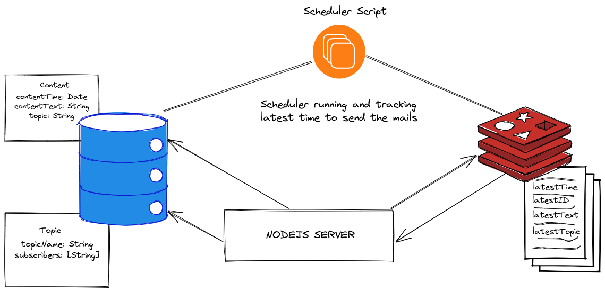

<div id="top"></div>

<br />
<div align="center">
  <a href="https://github.com/tanay13/newsletter-service">
    
  </a>

  <h3 align="center">Newsletter Service</h3>

  <p align="center">
    A newsletter service to send mails to all the subscribers of a particular topic.
    <br />
    ·
    <a href="https://github.com/tanay13/newsletter-service/issues">Report Bug</a>
    ·
    <a href="https://github.com/tanay13/newsletter-service/issues">Request Feature</a>
  </p>
</div>

<!-- TABLE OF CONTENTS -->
<details>
  <summary>Table of Contents</summary>
  <ol>
    <li>
      <a href="#about-the-project">About The Project</a>
      <ul>
        <li><a href="#built-with">Built With</a></li>
      </ul>
    </li>
    <li>
      <a href="#getting-started">Getting Started</a>
      <ul>
        <li><a href="#prerequisites">Prerequisites</a></li>
        <li><a href="#installation">Installation</a></li>
      </ul>
    </li>
    <li><a href="#usage">Usage</a></li>
    <li><a href="#roadmap">Roadmap</a></li>
    <li><a href="#contributing">Contributing</a></li>
    <li><a href="#license">License</a></li>
    <li><a href="#contact">Contact</a></li>
    <li><a href="#acknowledgments">Acknowledgments</a></li>
  </ol>
</details>

<!-- ABOUT THE PROJECT -->

## About The Project

 

While adding the newsletter content we are checking for <b>latestTime</b> key in the redis. If the new content time is lesser than the already stored <b>latestTime</b> key in redis then update all the keys in the redis, which are

1. latestTime \
2. latestText
3. latestTopic
4. latestId - ID of the content document

The scheduler script runs on an interval of 1 minute and checks whether the current time is equal or greater than the latestTime stored in the redis.

If the above condition satisfies then the mail is sent to all the subscribers of the **latestTopic**.
After sending the mail the sent content is deleted and the next latest deadline content is stored in the redis database

<p align="right">(<a href="#top">back to top</a>)</p>

### Built With

Tools that were used in the process of making this microservice are:

- [Node.js](https://nodejs.org/en/)
- [Express](https://expressjs.com/)
- [nodemailer](<[https://](https://reactjs.org/)>)

<p align="right">(<a href="#top">back to top</a>)</p>

<!-- GETTING STARTED -->

## Getting Started

To get a local copy up and running follow these simple steps:

### Prerequisites

This is an example of how to list things you need to use the software and how to install them.

- npm

  ```sh
  npm install npm@latest -g
  ```

### Installation

1. Clone this project.

   ```sh
   git clone https://github.com/tanay13/newsletter-service.git
   ```

2. Navigate to the cloned directory

   ```sh
   cd newsletter-service
   ```

3. Enter the following command

   ```sh
   node app.js
   ```

4. Start the scheduler script

   ```sh
   node script.js
   ```

<p align="right">(<a href="#top">back to top</a>)</p>

<!-- USAGE EXAMPLES -->

## Usage

- Post data to the following api to subscribe to a topic

  ```sh
  http://localhost/api/addSubs
  ```

  with body as :

  ```sh
  {
      "email": "rtanay65@gmail.com",
      "topic":"nutrition"
  }
  ```

- Post data to the following api to add the newsletter content

  ```sh
  http://localhost/api/addContent
  ```

  with body as :

  ```sh
  {
    "contentText": "hey this is a newsletter",
    "contentTime":"2022-05-04T15:26:30.281Z",
    "topic": "nutrition"
  }
  ```

<!-- ROADMAP -->

## Roadmap

- [x] Add readme
- [x] Add scheduler script

See the [open issues](https://github.com/newsletter-service/issues) for a full list of proposed features (and known issues).

<p align="right">(<a href="#top">back to top</a>)</p>

<!-- CONTRIBUTING -->

## Contributing

Contributions are what make the open source community such an amazing place to learn, inspire, and create. Any contributions you make are **greatly appreciated**.

If you have a suggestion that would make this better, please fork the repo and create a pull request. You can also simply open an issue with the tag "enhancement".
Don't forget to give the project a star! Thanks again!

1. Fork the Project
2. Create your Feature Branch (`git checkout -b feature/AmazingFeature`)
3. Commit your Changes (`git commit -m 'Add some AmazingFeature'`)
4. Push to the Branch (`git push origin feature/AmazingFeature`)
5. Open a Pull Request

<p align="right">(<a href="#top">back to top</a>)</p>

<!-- LICENSE -->

## License

Distributed under the MIT License. See `LICENSE.txt` for more information.

<p align="right">(<a href="#top">back to top</a>)</p>

<!-- CONTACT -->

## Contact

Your Name - [Tanay](https://twitter.com/tanayhere) - tanay.raj76@gmail.com

Project Link: [https://github.com/tanay13/newsletter-service](https://github.com/tanay13/newsletter-service)

<p align="right">(<a href="#top">back to top</a>)</p>
```
